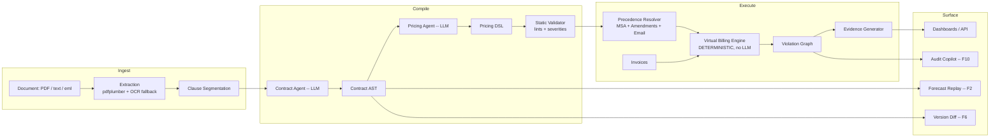

# LedgerHawk

**CI/CD for Enterprise Contracts.**

Contracts are compiled into executable pricing rules. Invoices are test runs.
Overcharges are failing tests - with evidence, dollar amounts, and a dispute
letter.

[](https://github.com/dipeshrayg/ledgerhawk/actions/workflows/ci.yml)
[](https://github.com/dipeshrayg/ledgerhawk/actions/workflows/deploy-pages.yml)
[](LICENSE)

### 🔴 [Live demo - no install, no clone](https://dipeshrayg.github.io/ledgerhawk/)

The link above is a fully static build: every screen (dashboard, vendor CI
history, forecast, calendar, version diff, pre-sign review, and the Audit
Copilot chat) runs entirely client-side against pre-rendered demo data -
see [How the live demo works](#how-the-live-demo-works) below.

## The problem

Businesses sign contracts with precise pricing terms - per-seat rates,
escalation caps, time-bound discounts, proration policies - and then pay
whatever the vendor invoices, because nobody has time to re-derive the
correct number from a 40-page MSA and three amendments every month. The
leakage is invisible by construction: it looks exactly like a normal invoice.

LedgerHawk treats a contract the way a compiler treats source code. It
extracts the pricing terms into a typed AST, lowers that into an executable
DSL, and **replays every invoice against a deterministic Virtual Billing
Engine**. A mismatch isn't a "finding" in the vague sense - it's a failing
test, with the exact clause, the exact arithmetic, and the exact dollar
delta.

## Core design law

> LLMs only ever translate language into structured artifacts a human can
> inspect (the Contract AST, the Pricing DSL, risk annotations). **All money
> math is deterministic, `Decimal`-based, plain Python, and unit-tested.**
> Every finding traces to: verbatim clause quote → compiled rule →
> arithmetic. Nothing about a dollar figure is ever hallucinated.

This is why the Billing Agent (the thing that multiplies a rate by a
quantity) has no LLM anywhere near it - see
[`api/app/pipeline/billing_engine.py`](api/app/pipeline/billing_engine.py).

## 90-second quickstart (running it yourself)

Only needed if you want the real backend (e.g. to try live LLM mode, hit
the API directly, or use the connector endpoints) - for just *viewing* the
product, use the [live demo link](#-live-demo--no-install-no-clone) above
instead.

```bash
git clone https://github.com/dipeshrayg/ledgerhawk.git
cd ledgerhawk
./run.sh          # Windows: .\run.ps1
```

That's it - 3 commands. The API seeds itself from checked-in demo fixtures
(no API key needed) and the dashboard opens at **http://localhost:5173**.

- API: http://localhost:8000/api/health
- Web: http://localhost:5173

Runs identically with **zero API keys** (demo mode, default) or with
`GEMINI_API_KEY` / `GROQ_API_KEY` set (live LLM mode). Check `/api/health`
if you want to confirm which mode is active; every dollar figure is
computed the same way in both.

## Architecture - the compiler pipeline



Full pipeline stage docs: [docs/ARCHITECTURE.md](docs/ARCHITECTURE.md) ·
DSL reference: [docs/DSL.md](docs/DSL.md) · AST reference:
[docs/AST.md](docs/AST.md) · demo data ledger (every planted finding, with
dollars): [docs/DEMO_DATA.md](docs/DEMO_DATA.md) · research paper:
[docs/RESEARCH_PAPER.md](docs/RESEARCH_PAPER.md) · slide deck:
[docs/PRESENTATION.md](docs/PRESENTATION.md) · spoken pitch script:
[docs/PRESENTATION_SCRIPT.md](docs/PRESENTATION_SCRIPT.md).

## Feature grid

| # | Feature | What it does |
|---|---|---|
| F1 | **Reconciliation** | Per-invoice PASS/FAIL vs. the Virtual Billing Engine, with clause-quote evidence and one-click dispute letters. |
| F2 | **Leakage Forecast** | Deterministic 36-month DSL replay - escalations, discount expiries, auto-renewal uplifts. No ML; it's contract replay. |
| F3 | **Connector SDK** | `InvoiceSource` interface + MockERP streaming connector + CSV drop-folder watcher + optional Stripe sandbox. |
| F4 | **Pre-Sign Review** | Static Validator lints + illustrative benchmark comparison + 3-year cost projection for an unsigned proposal. |
| F5 | **Negotiation AI** | Alternative terms, a ready-to-send email, a risk score, and a computed expected-savings figure. |
| F6 | **Version Diff** | "git diff for contracts" - categorized, dollar-quantified rule changes between two compiled contract versions. |
| F7 | **Renewal Risk Calendar** | Every renewal, notice deadline, discount/credit expiry, and scheduled escalation, with days-remaining badges. |
| F8 | **Contract Unit Tests** | `contract_tests.yaml` scenario + invariant assertions, run against the compiled DSL. |
| F9 | **Contract CI** | Every new invoice auto-runs reconciliation + contract tests → PASS/FAIL, with a CI history log and build-status badge per vendor. |
| F10 | **Audit Copilot** | NL chat over the Violation Graph - every answer is graph-sourced, never free-generated. |
| F11 | **CFO Dashboard** | Recovered leakage, forecasted leakage, compliance %, vendor risk ranking, top violating clauses. |
| F12 | **Rule Inspector** | Compiled effective terms per vendor, with per-rule provenance ("from Amendment 2, §3"). |

## DSL example

```json
{
  "rule_id": "amend2:pricing.per_unit.seat",
  "rule_key": "pricing.per_unit.seat",
  "rule_type": "per_unit",
  "source_name": "Amendment 2 §3",
  "effective_from": "2025-01-01",
  "provenance": {
    "quote": "Effective January 1, 2025, the per-seat fee set forth in MSA Section 6.2 is amended to $16.50 per active seat per month."
  },
  "params": { "unit_name": "seat", "rate": "16.50" }
}
```

Full DSL reference with escalation, volume tiers, proration, and credit
rollover semantics: [docs/DSL.md](docs/DSL.md).

## Contract-test example

Legal and procurement teams write assertions against the *compiled*
contract, in YAML, the same way an engineer writes a unit test:

```yaml
vendor_id: megacloud
tests:
  - name: "Escalation cap must never exceed 10%"
    type: invariant
    rule_key: "pricing.escalation.default"
    field: cap_pct
    operator: "<="
    value: "10"
```

The unsigned `TalentBridge HR Suite` proposal fixture has a **deliberately
failing** test (`data/proposal/contract_tests.yaml` - its escalation clause
is quarterly, not annual) so `F8`'s red/green behavior is visible on day one.

## The demo dataset, at a glance

Five vendors, 12 months of invoices each, **14 planted discrepancies**,
reconciled by the exact engine in this repo (see
[docs/DEMO_DATA.md](docs/DEMO_DATA.md) for every finding, month, clause, and
dollar amount):

- **Recovered leakage: $86,420.40** across 14 findings, 0 false positives on
  the other 46 invoices (PeakServers Hosting is a fully clean vendor -
  proof the tool doesn't cry wolf).
- **MegaCloud Inc.** is the flagship: an MSA + 3 amendments + one executed
  email agreement, exercising full multi-document precedence resolution -
  the email's loyalty-discount extension is correctly honored over the
  superseded amendment.
- **36-month forecast**: MegaCloud's cost jumps **$67,494.40/mo** five
  months out at its 2027 renewal (15% auto-renewal uplift compounding with
  ongoing escalation) - an **$809,932.80/yr** projected impact, computed by
  contract replay, not prediction.

## Tech stack

- **Backend**: Python 3.12+, FastAPI, SQLAlchemy + SQLite, Pydantic v2.
- **Frontend**: React + Vite + Tailwind v4 + Recharts.
- **LLM (optional)**: Gemini or Groq, behind a single provider interface
  (`api/app/agents/llm_provider.py`) - every agent has a deterministic
  fallback and the product is feature-complete with neither key set.

## How the live demo works

The [GitHub Pages link](https://dipeshrayg.github.io/ledgerhawk/) is a
**fully static site with no backend** - GitHub Pages only serves files.
This works because the entire demo dataset is deterministic (fixed seed
data, fixed reference date - `demo_today` in `api/app/config.py`), so:

1. `api/scripts/export_static.py` boots the real FastAPI app in-process and
   calls every endpoint it needs, dumping each response as a static JSON
   file under `web/public/static-data/`. These are byte-identical to what
   the live server returns - generated by actually calling the app, not by
   reimplementing its logic.
2. The frontend's `api.js` has two modes, switched by a `VITE_STATIC` build
   flag: live mode `fetch()`s `/api/...`; static mode `fetch()`s the
   matching pre-rendered JSON file instead. Every page component is
   identical either way.
3. The one genuinely interactive feature - the Audit Copilot's free-text
   chat - has its Python intent-matching logic
   (`app/pipeline/copilot.py`) hand-ported to JavaScript
   (`web/src/lib/copilotStatic.js`), running client-side against an
   exported violation-graph snapshot. Same 8 query patterns, same
   graph-sourced-only answers, no server round-trip.
4. `.github/workflows/deploy-pages.yml` runs the export script, builds the
   site, and publishes it via GitHub's official Pages Actions on every push
   to `main`.

Local dev (`./run.sh`) always talks to a real, live FastAPI server - the
static export only matters for the Pages deployment.

## Running the tests

```bash
cd api && ../.venv/Scripts/python -m pytest -q      # 67 tests incl. the e2e ledger check
cd web && npm run lint && npm run build && npm test
```

## Limitations (honest)

- **Escalation cadence**: the Billing Engine's escalation math compounds on
  an annual anniversary clock regardless of a rule's stated `frequency`.
  Quarterly/other cadences are recognized and flagged by the Static
  Validator as elevated risk, but not given distinct compounding arithmetic
  - a deliberate scope cut, not a hidden gap.
- **Live LLM extraction** (Contract/Pricing Agents turning raw text into an
  AST/DSL) is implemented with schema-validated retries
  (`api/app/agents/compiler_agents.py`) but only exercised by unit-level
  code paths here - the 5 demo vendors always ship as pre-extracted
  fixtures, per the "zero-key demo mode" requirement. Live extraction on a
  real, uploaded arbitrary contract is a natural next step, not yet wired
  into the UI's upload flow.
- **F3 connectors**: MockERP and the CSV drop-folder watcher are fully
  functional. The Stripe sandbox connector authenticates but does not yet
  map Stripe's invoice object graph into LedgerHawk's schema - activates
  only if `STRIPE_API_KEY` is set, and is explicitly labeled illustrative.
  Real ERP connectors (QuickBooks, NetSuite, SAP) are roadmap, not faked.
- **Benchmarks** (`api/data/benchmarks.json`) are illustrative, hand-set
  figures for the demo - not sourced from real market data. Labeled as such
  everywhere they're surfaced.
- **Single-tenant, no auth** - this is a demo/hackathon build, not
  production-hardened multi-tenant software. See
  [docs/ARCHITECTURE.md#scaling](docs/ARCHITECTURE.md#scaling) for the
  path past that.
- **Volume-tier billing is graduated** (each tier only prices the units that
  fall inside it), not "highest-tier-for-the-whole-quantity" - documented
  in [docs/DSL.md](docs/DSL.md), in case your contract uses the other
  convention.

## License

MIT - see [LICENSE](LICENSE). Open for anyone to use, fork, or build on.
What it doesn't allow is stripping the copyright notice and claiming
authorship - see [docs/PROVENANCE.md](docs/PROVENANCE.md) for what backs
that up and why it holds up.

## Author

Built by [Dipesh Ray](https://github.com/dipeshrayg).
